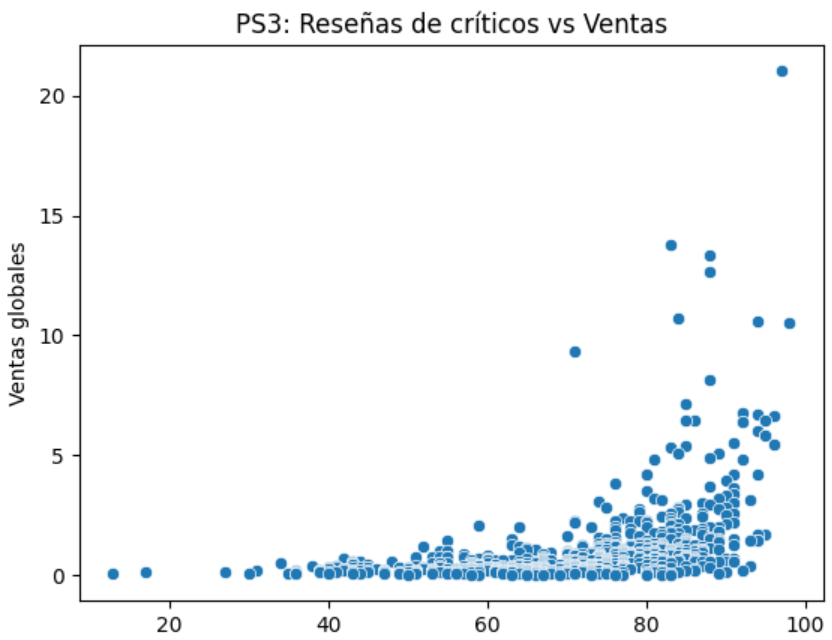
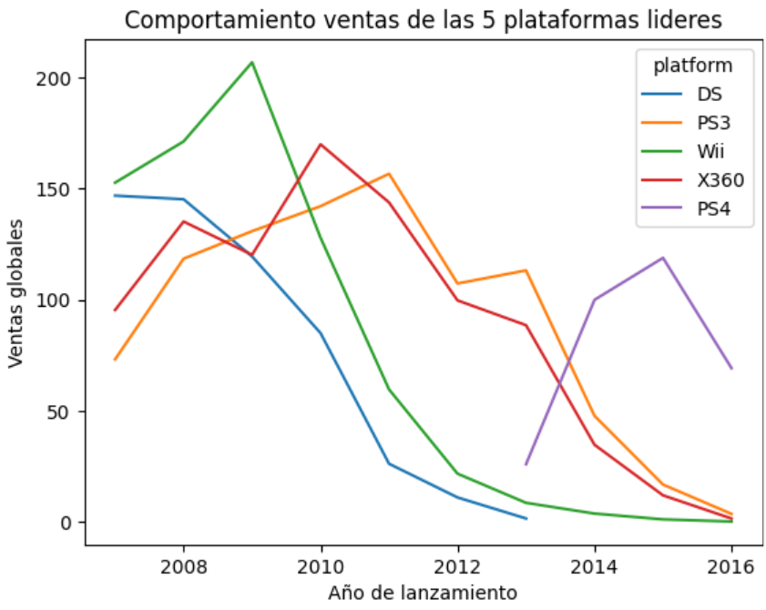
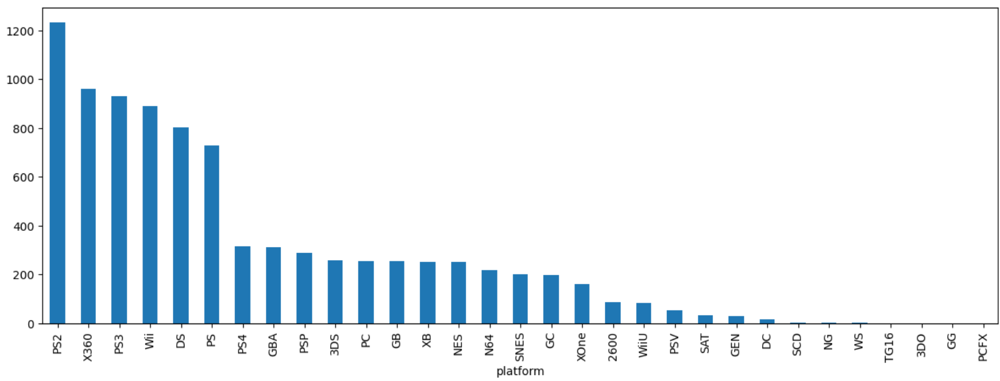

# 03-video-game-sales-analysis
VIDEO GAME SALES ANALYSIS

## Descripción del proyecto 
Análisis de ventas históricas de videojuegos para identificar factores que determinan el éxito de un producto, con enfoque en decisiones de marketing.

## Problema de negocio
Una empresa necesita decidir:
- Qué tipo de juegos lanzar
- En qué plataformas enfocarse
- Cómo segmentar mercados

## Objetivo
Identificar variables clave que impactan el éxito de un videojuego:
- Plataforma
- Género
- Región
- Reseñas

## Mi contribución
- Limpieza y estandarización de datos
- Creación de métricas de ventas globales
- Análisis por región
- Aplicación de pruebas estadísticas

## Análisis realizado
- Juegos lanzados por año
- Ciclo de vida de plataformas
- Ventas por plataforma
- Correlación entre reseñas y ventas
- Análisis por género
  
## Insights clave
- Las preferencias cambian significativamente por región
- Algunas plataformas dominan mercados específicos
- Las reseñas influyen moderadamente en ventas
- El ciclo de vida de la plataforma impacta el rendimiento

## Impacto en negocio
- Mejor selección de plataformas
- Estrategias de marketing por región
- Reducción de riesgo en lanzamientos

## Enfoque financiero
- Identificación de productos con mayor potencial de ventas
- Apoyo en decisiones de inversión en desarrollo
- Optimización de portafolio de productos

## Tecnologías
- Python
- Pandas
- NumPy
- Matplotlib
- SciPy

## Evidencia visual
Representa si existe relación entre la calificación que dan los críticos dependiendo la cantidad de ventas:

Representa el comportamiento de ventas de cada plataforma en cada año de su lanzamiento:

Variación de ventas por plataforma::

## Aprendizajes
- Importancia del análisis regional
- Cómo conectar datos con decisiones estratégicas
- Uso de hipótesis en negocio

